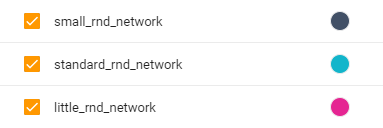
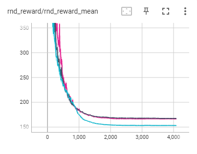
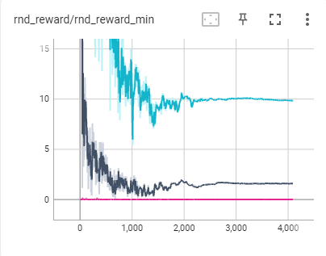
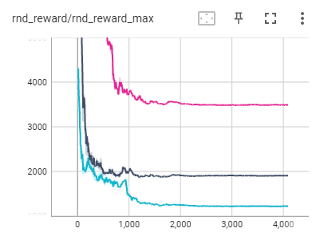

# RestMin_v1_RND_test
测试RestMin_v1环境下最佳的RND奖励模型的网络结构：
<ul>
<li>little：[16, 8]</li>
<li>small：[16, 16]</li>
<li>standard：[32, 32]</li>
</ul>
PS，模式1下，环境的obs展开后的维数为72；网络尺寸的命名是测试进行的，与结果无对应关系。

## 测试过程
<ol>
<li>使用随机策略，收集train data，4096个episode，每个episode收集50个step。</li>
<li>使用随机策略，收集test data，一共20480个step。</li>
<li>在4096次episode的循环中：使用一个episode的train data训练一次target网络，再估计一次test data中所有step的内在奖励，记录这一批奖励的mean，min和max。</li>
</ol>

## 测试结果
为了显示上的便利，所有指标放大了 1e5 倍。

| 指标 | 图示 | 说明 |
| :---: | :---: | :---: |
| mean |  | 三个网络差别不大。 |
| min |  | little网络接近于0，表现最佳，small和standard网络存在一定程度的过拟合。 |
| max |  | little网络最佳，与mean的差值最大。 |

## 小结
little网络，即hidden layer为[16, 8]，表现最佳。
